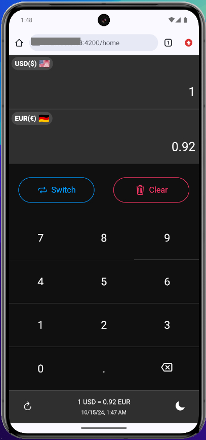
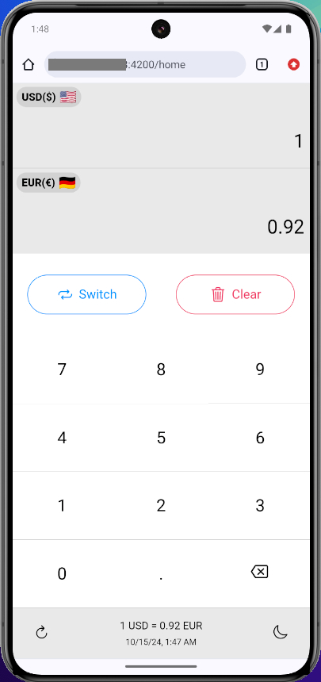
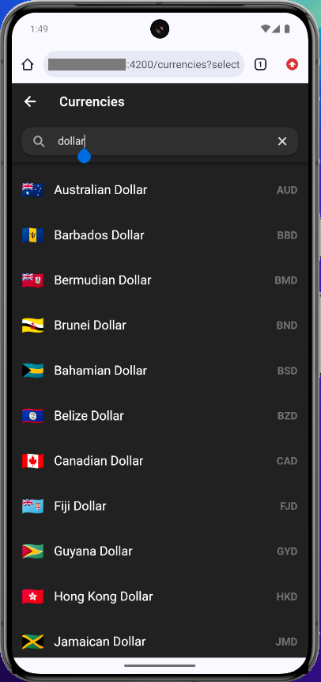

# Currency Converter App
This app is a responsive currency converter built using **Angular**, **Ionic**, and **Capacitor**. It is designed to work seamlessly across all screen sizes, from mobile devices to tablets and desktops. The app provides **real-time** currency conversion with features like dark mode, light mode, and a searchable currency list.
## Key Technologies


- **Angular**: For the core structure and component-based architecture.
- **Ionic**: For adaptive and responsive UI components across multiple device sizes.
- **Capacitor**: For integrating native functionality and building native iOS/Android apps.
- **RxJS**: For efficient state management and handling asynchronous real-time data updates.

## Features

- **Real-time Currency Conversion**: Get up-to-date exchange rates and accurate conversions in real time.
- **Dark Mode / Light Mode**: Users can easily switch between dark and light themes for better usability.
- **Responsive Design**: The app automatically adapts to different screen sizes, from small mobile screens to larger tablets and desktops.
- **Currency Search**: Users can search for their currency using a fast, intuitive search bar.
- **Easy-to-use Interface**: Clean and simple UI that provides a user-friendly experience.
## Screenshots


*Currency App Recording*


*Dark Mode*


*Light Mode*


*Currency Search*
## How to Run the Project


**Clone the repository**

```bash
git clone https://github.com/mohamedkuch/currency-vault
```
    
**Navigate to the project directory:**

```bash
cd currency-converter-app
```
    
**Install the dependencies:**

```bash
npm install
```
    

**Run the project:**

```bash
ng serve
```
or 
```bash
ionic serve
```
## Notes

- The app uses **real-time** data for currency prices, ensuring accurate conversions at all times.
